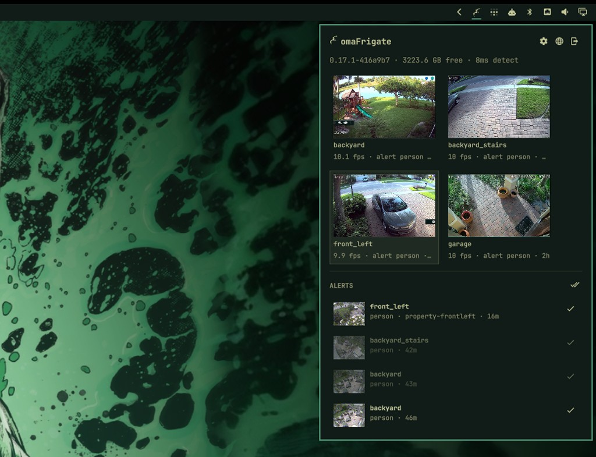

# omaFrigate

Frigate cameras in the Omarchy bar.

Click the camera icon for latest stills, a live view, and review alerts. A camera you temporarily mute in Frigate stays silent here. Frigate's unused email/webpush notification service does not have to be on.



Plugins run unsandboxed inside `omarchy-shell` with your user permissions. Read the code before you enable it.

## Requirements

- [Omarchy](https://omarchy.org/) with shell plugin support
- A reachable [Frigate](https://frigate.video/) instance (0.14+ for review alerts)
- [`mpv`](https://mpv.io/) on `PATH` for live windows and clips

## Install

```sh
omarchy plugin add https://github.com/luccast/omaFrigate.git --enable
```

The widget lands on the right side of the bar. Move it with:

```sh
omarchy bar move io.github.luccast.frigate
```

Update later with `omarchy plugin update io.github.luccast.frigate`.

## Connect

Click the bar icon. The first time, you get a connection form.

| Frigate | URL | Username / password |
| --- | --- | --- |
| Same machine, unauthenticated API | `http://127.0.0.1:5000` | Leave blank |
| Authenticated UI | `http://HOST:8971` | Frigate user |

The password is stored only in `~/.local/state/omarchy/frigate.json` (`0600`). After a successful login, the form hides. Use the header logout button to sign out and clear credentials.

The header browser icon opens Frigate in your default browser.

## Use

| Action | Result |
| --- | --- |
| Click the bar icon | Open or close the panel |
| Escape | Close the panel |
| Click a camera still | Open a floating `mpv` live view and close the panel |
| Click an alert | Play the clip (or go live if it is still in progress) and mark it reviewed |
| Check on an alert | Dismiss it |
| Mark all | Mark every listed alert reviewed |

The status line shows Frigate version, recordings disk free, and detector time. Each camera tile shows fps or offline, plus the last review object.

Stills refresh only while the panel is open.

## Live windows

Each camera opens its own `mpv` window. Multiple cameras stack. Super-drag moves them; the window close button or `q` closes one.

By default the stream is Frigate's MJPEG endpoint (`/api/<camera>`). In the panel gear, **Higher quality stream** switches to the camera's RTSP main stream (H264). That needs the camera's own username and password, not the Frigate login.

Add this to `~/.config/hypr/hyprland.lua` (after Omarchy's defaults) so the windows float instead of tiling:

```lua
o.window("^omaFrigate-live", {
  tag = "-default-opacity",
  float = true,
  pin = true,
  no_dim = true,
  opacity = "1 1",
  size = { 640, 360 },
  keep_aspect_ratio = true,
})
```

Hyprland reloads on save. If a window looks wrong, run `hyprctl reload` and check `hyprctl configerrors`.

## Alerts

omaFrigate polls Frigate reviews and only toasts **unseen `severity=alert` items**. A camera that is temporarily muted in Frigate stays silent. Frigate's email/webpush notification service can stay off.

Click a toast to open the panel. Turn on **Live popup on alerts** in settings if you also want the floating camera to appear; that is off by default.

The **Alerts** list shows unreviewed alerts with thumbnails.

## Settings

Open the gear in the panel header (visible after login).

| Setting | Default |
| --- | --- |
| Live popup on alerts | Off |
| 4:3 aspect ratio | Off (16:9) |
| Higher quality stream | Off (MJPEG) |

## Remove

```sh
omarchy plugin remove io.github.luccast.frigate
```

## Develop

From this checkout:

```sh
PLUGIN_ID=io.github.luccast.frigate
PLUGIN_DIR="$HOME/.config/omarchy/plugins/$PLUGIN_ID"
mkdir -p "$(dirname "$PLUGIN_DIR")"
rsync -a --delete --exclude .git ./ "$PLUGIN_DIR/"
omarchy plugin validate "$PLUGIN_DIR"
omarchy plugin enable "$PLUGIN_ID"
```

Omarchy rejects plugin-folder symlinks, so copy rather than link. Saving files under `~/.config/omarchy/plugins/` reloads the plugin.

```sh
omarchy-shell shell summon io.github.luccast.frigate '{}'
omarchy-shell shell hide io.github.luccast.frigate
```

## License

[MIT](LICENSE)
